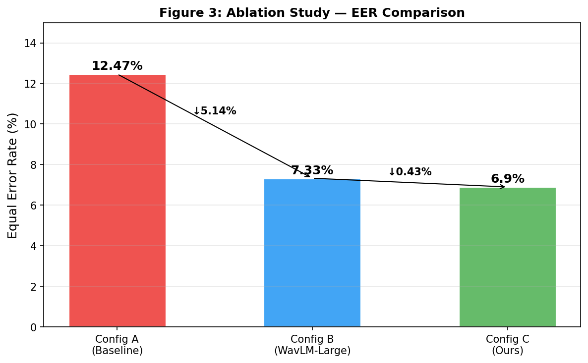
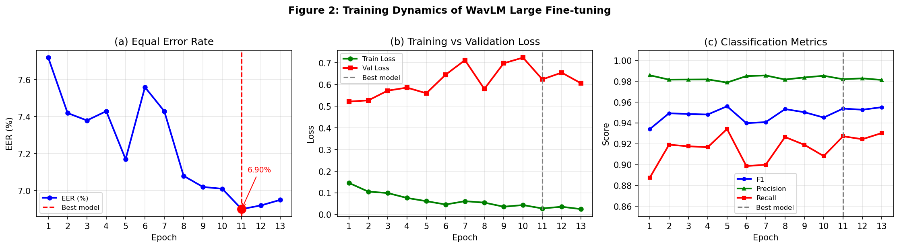
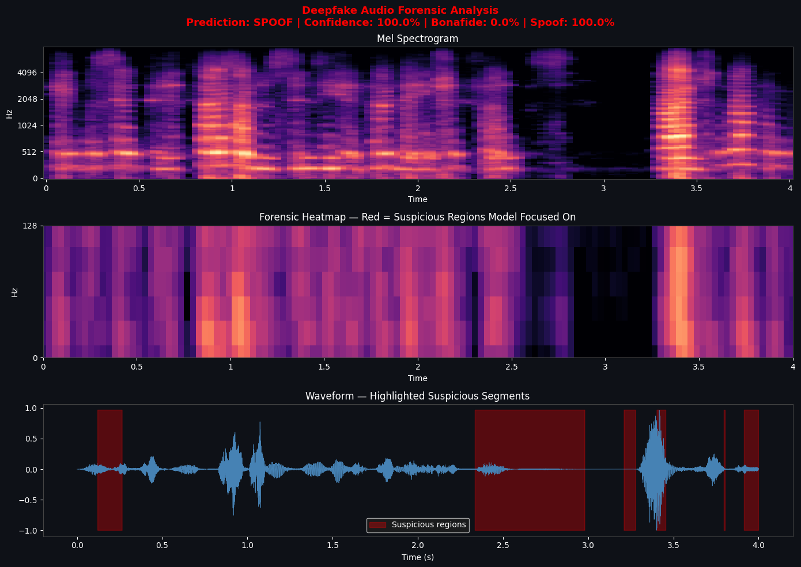
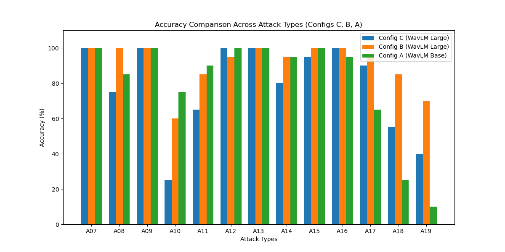

# DeepFake Audio Detection Using Fine-Tuned WavLM Large

A deepfake audio detection system based on **WavLM Large**, fine-tuned for binary classification of bonafide and spoofed speech using **ASVspoof 2019 LA** and **ASVspoof 5**.

The project combines parameter-efficient fine-tuning, waveform-level augmentation, multi-dataset training, attack-specific evaluation, and temporal explainability using Grad-CAM.

## Overview

Synthetic speech generated through neural text-to-speech and voice conversion systems can be difficult to distinguish from genuine speech. This project investigates whether a large self-supervised speech representation model can be efficiently adapted for audio spoof detection while providing interpretable evidence for its predictions.

The final system uses:

- **WavLM Large (315M parameters)**
- **ASVspoof 2019 LA + ASVspoof 5**
- Parameter-efficient fine-tuning of the upper Transformer layers
- RawBoost-style waveform augmentation
- Binary bonafide/spoof classification
- Grad-CAM-based temporal explainability
- Per-attack generalization analysis

## Results

The best-performing configuration achieved:

| Metric | Result |
|---|---:|
| Accuracy | **92.85%** |
| Precision | **98.20%** |
| Recall | **92.72%** |
| F1-score | **95.38%** |
| EER | **6.90%** |

The final configuration uses WavLM Large with the final five Transformer encoder layers fine-tuned at a learning rate of `5e-5`.

### Experimental Comparison

The experiments compare three configurations:

| Configuration | Model | EER |
|---|---|---:|
| A | WavLM Base | 12.47% |
| B | WavLM Large | 7.33% |
| C | WavLM Large + deeper fine-tuning | **6.90%** |



## Training Dynamics



## Explainability

Grad-CAM is used to generate temporal saliency maps over Mel spectrograms and raw waveforms. The visualization highlights the portions of an audio signal that contributed most strongly to the model's prediction.



## Attack-Specific Evaluation

The model was additionally evaluated on unseen ASVspoof 2019 LA attack categories to examine generalization across different spoofing techniques.

The evaluation covered 13 attack types (A07–A19), with an average detection accuracy of **79.2%**.



## Methodology

### Dataset

The training pipeline combines balanced subsets from:

- ASVspoof 2019 LA
- ASVspoof 5

The combined training corpus contains **38,160 samples**. ASVspoof 5 is used as the primary test set, while the ASVspoof 2019 evaluation partition is used for attack-specific generalization analysis.

### Audio Preprocessing

Audio is:

- resampled to **16 kHz**
- converted to mono
- truncated or zero-padded to **4 seconds**
- normalized through the WavLM feature extractor

### Training

The WavLM Large backbone is mostly frozen, with only the upper Transformer layers and classification head updated.

RawBoost-style waveform augmentation is applied during training to introduce simulated channel and environmental distortions.

Early stopping is based on validation EER.

### Explainability

Grad-CAM is adapted to the temporal representations of WavLM to generate saliency maps over the audio timeline.

The resulting explanations are visualized using:

1. Mel spectrograms
2. Grad-CAM heatmaps
3. Waveforms with highlighted suspicious regions

## Repository Contents

```text
.
├── DeepFake_Audio_Detection.ipynb
├── README.md
├── requirements.txt
├── .gitignore
└── results/
```

The notebook contains the dataset preparation, preprocessing, training, evaluation, explainability, and attack-specific analysis pipeline.

## Running the Notebook

Install the required dependencies:

```bash
pip install -r requirements.txt
```

The notebook downloads the required ASVspoof datasets using `kagglehub`.

The training section can be executed to reproduce the model training process.

The explainability section requires a locally available fine-tuned WavLM checkpoint. **Pretrained/fine-tuned checkpoints are not included in this repository.**

## Research Paper

The accompanying research paper is currently under preparation and is therefore not included in this repository.

## Limitations

The model shows substantially stronger performance on several neural TTS attacks than on some voice-conversion attacks. In the attack-specific analysis, VAE-based voice conversion is a notable failure case.

Future improvements include stronger robustness to voice-conversion attacks and broader evaluation under unseen conditions.

## Technologies

- Python
- PyTorch
- Hugging Face Transformers
- WavLM
- Librosa
- NumPy
- Scikit-learn
- Matplotlib
- SciPy
- KaggleHub